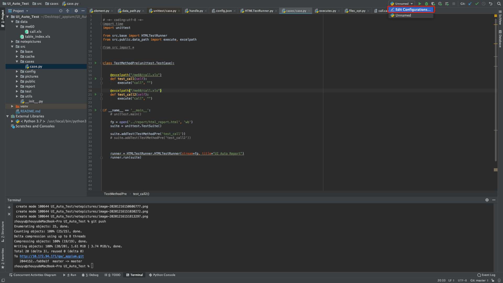
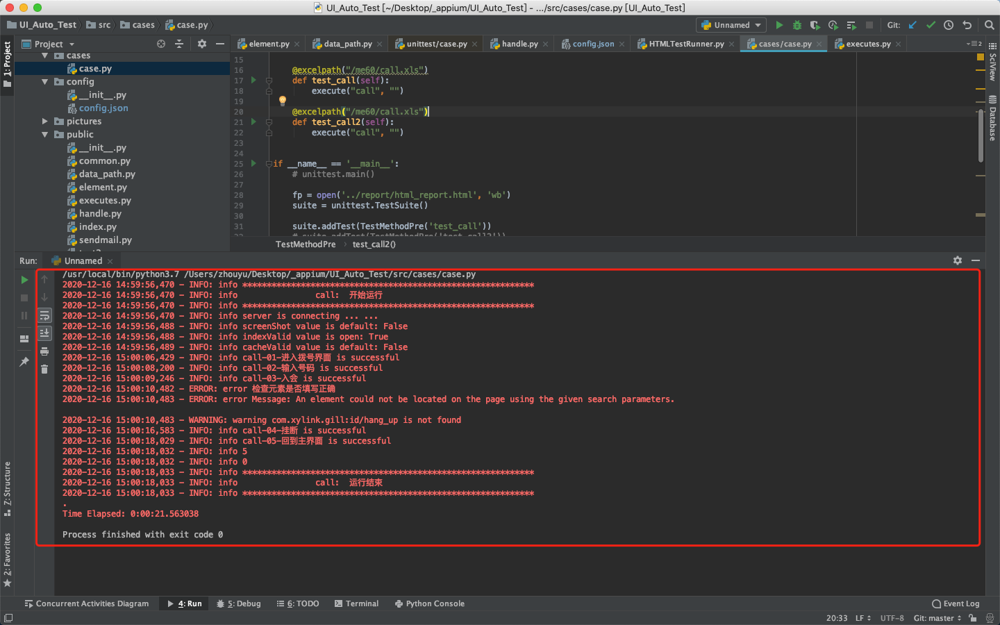

## readme分为以下几个部分
* 环境搭建
* 项目目录
* 框架使用
* case整理流程
* 相关机制和配置文件的使用
    * 截图机制
    * 索引机制
    * 缓存机制
    * 重试机制
    * 数据驱动
    * 多进程并行（支持不同浏览器兼容性测试）

### 环境搭建

* python3环境
* 按照浏览器版本下载对应驱动，放到python.exe的安装目录下，具体百度


### 项目目录

- project
  - data
    - Me60
  - src
    - base
      - HTMLTestRunner.py
    - cache
      - cache.cah
    - cases
    - config
      - config.py
    - pictures
    - public
      - common.py
      - data_path.py
      - element.py
      - executes.py
      - handle.py
      - index.py
      - sendemail.py
    - report
      - html_report.html
    - utils
      - excel_opt.py
      - files_opt.py
      - json_opt.py
      - log_opt.py
      - time_wait_opt.py

### 框架使用

* 拉取代码，pycharm打开
* 启动appium
* 打开cmd，adb连接设备
* 运行代码


### case整理流程

* 找元素
* 填写case表格
* 配置case文件


1.找元素


2.写case

   


元素定位和操作

 * name：每个场景的的测试步骤，对应到testlink里的case步骤，建议尽量详细

 * by：定位元素的方式，没有写null

 * element：和定位方式相对应的元素值

 * operation：对当前元素的操作，见封装列表

 * data：操作元素涉及到的数据值没有写null

   

当前页面的验证

在当前页面找一个指定元素（尽量是当前页面独有的元素），若定位成功，则当前步骤通过，否则失败

* check_by：校验元素的定位方式
* check_element：定位方式对应的元素值


3.case文件配置


```
@excelpath("/me60/call.xls") //填写表格的相对路径
	    def test_call(self):   //以"test_"开头自定义名称，函数名唯一
        execute("call", "")  //第一个参数填写case表格的名称，
                             //第二个是dd文件的绝对路径，目前ddt只支持yaml格式即以".yml"或".yaml"结尾的文件，不需要ddt文件传空
      
      
suite.addTest(TestMethodPre('test_call')) //上面函数的名字
```






### 框架相关机制介绍

#### 配置文件


#### 截图机制

```json
"screenShot":false,    //是否开启截图功能
"picturePath":"/Users/zhouyu/Desktop/_appium/UI_Auto_Test/src/pictures/", //若开启，需要配置截图存放路径，绝对路径
```

* 截图机制开启，每个元素操作后都会进行终端全屏截取，整体case执行时间会拉长

#### 索引机制

```json
"indexValid":true, //是否开启索引机制
"indexPath":"/Users/zhouyu/Desktop/_appium/UI_Auto_Test/data/table_index.xls",//开启索引机制后配置索引表的绝对路径
```

* 索引机制为了帮助解决以下可能出现的场景

  * 例如某个元素在所有case中都使用到，当前元素的查找方式或者元素值发生改变，可以把变之前的的信息和变之后的信息填写在索引表中，程序执行过程中会动态切换元素（不改变原case中元素信息）

    

  * 索引机制中的注意点
    element是索引主键，必须全局唯一

#### 缓存机制

```json
"cacheValid":false  //是否开启缓存机制，
```

* 缓存机制是为了解决以下的场景

  * 索引表机制是基于全局遍历实现，当索引表的长度过长时，性能会降低。
  * 考虑到每个case使用到的索引表中的元素量并不多，索引第一次执行后会把每个case中用到的元素单独缓存到`.cah`的文件中

  * 索引机制大致流程如下：
    * 第一次执行时，会走索引，对于本case中用到的元素会缓存到`.cah`文件中
    * 运行时，先尝试按照原元素定位，若失败，会先走缓存文件，缓存中找不到，去索引中匹配
    * 索引中匹配到后会加载到缓存中，匹配不到则按照原元素信息执行
    * 缓存文件中有`change`这一项，如果值为true表示过程中缓存的信息发生改变，case执行结束后会把新的缓存信息会写到缓存文件中，如果为false，表示缓存信息未发生改变，则不会刷新原缓存文件
    * 缓存文件中每个元素中都有一个引用计数器，当缓存数据加载到内存后，计数器会被置为0，每次引用，元素加一，change置为true，case执行结束后会先把引用为0的元素删除，最后刷入原缓存文件中

索引机制和缓存机制是为了解决元素发生改变导致大量case需要修改的问题，正常情况下无需打开，这两个机制建议做辅助使用，大家自己整理case时需要规划好，避免出现上述问题

#### 重试机制
  * 增加容错力，解决终端响应慢导致程序定位不到元素而误判运行失败的问题
  * 元素定位失败，不会立刻结束，会每隔5s重试一次，最多6次，6次都没有定位成功，判定失败

#### 数据驱动 ddt
  *  支持同一个case跑多组数据,详细见上述配置文件
   
#### 多进程并行
  * 多个浏览器同时跑case，并发兼容性测试，每个浏览器的测试对应一份测试报告
  * 只需要在配置文件里的`config`填上浏览器类型
  * 最多支持五个不同浏览器并发运行